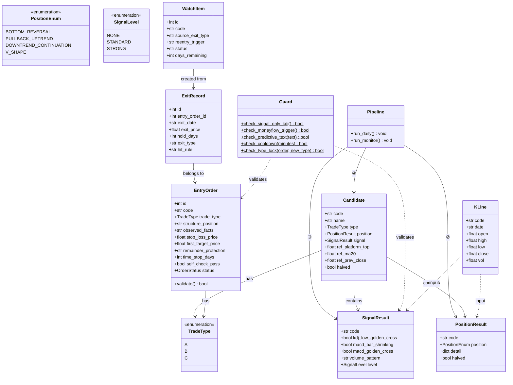
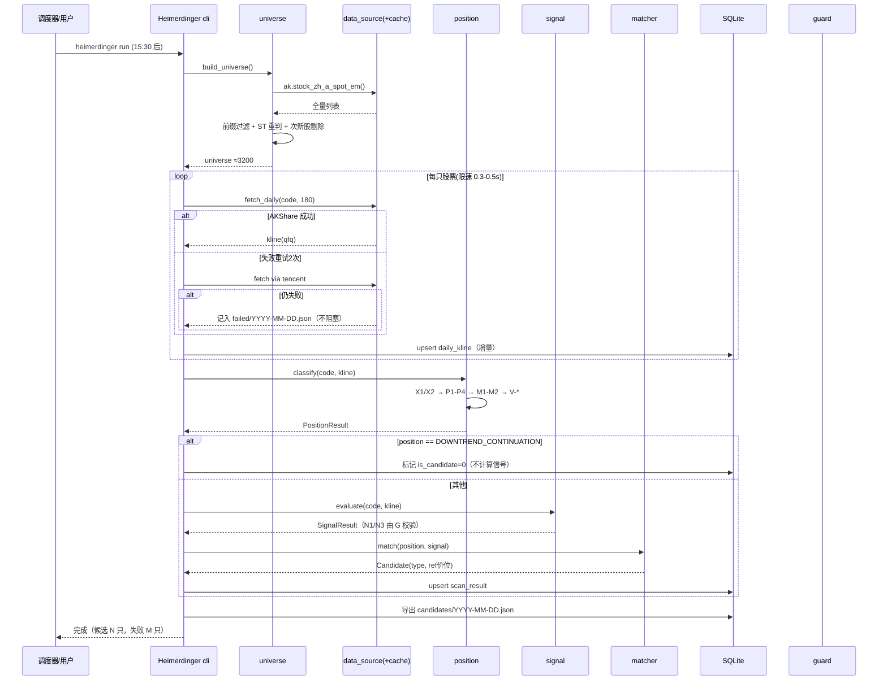
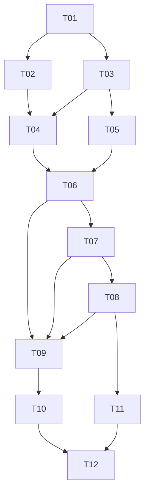

# Heimerdinger 系统架构设计

> 版本：v1.0 | 日期：2026-09-18 | 对应规范：v1.3
> 形态：**CLI 核心（每日收盘后跑全流程）+ Web UI（查看与填写）**，两者共享同一份 SQLite 数据。

---

## 1. 架构总览

```
┌────────────────────────────────────────────────────────────┐
│  CLI 入口  heimerdinger run / heimerdinger scan / heimerdinger monitor          │
│            （每日 15:30 后由调度器或手动触发）                │
└──────────────────────┬─────────────────────────────────────┘
                       │
┌──────────────────────▼─────────────────────────────────────┐
│  Pipeline（六阶段，顺序不可颠倒）                            │
│  ① universe → ② position(硬过滤) → ③ signal → ④ match      │
│  ⑤ entry_order(人工) → ⑥ monitor/exit + watch_pool          │
└──────────────────────┬─────────────────────────────────────┘
                       │ 读写
┌──────────────────────▼─────────────────────────────────────┐
│  Storage：SQLite（日线缓存 / 扫描结果 / 入场单 / 持仓 /       │
│            出场记录 / 观察池 / 违规日志 / 参数版本）           │
└──────────────────────┬─────────────────────────────────────┘
                       │ 只读 + 少量写
┌──────────────────────▼─────────────────────────────────────┐
│  FastAPI（薄层，仅供 Web UI）  ←→  Vue3 + Element Plus        │
└────────────────────────────────────────────────────────────┘
```

**设计原则**

| 原则 | 说明 |
|------|------|
| CLI 优先 | 全流程可在无 UI 情况下跑通；Web 只是查看与填写层 |
| 位置优先 | 硬过滤先于信号计算，下跌中继不进入信号模块 |
| 快照不可变 | 入场单一经保存即 append-only，杜绝事后改写 |
| 参数版本化 | 每次改参数生成新版本记录，保证历史结果可复现 |
| 守护横切 | N1-N8 负面规则由 `guard.py` 统一拦截，不散落在业务代码 |

---

## 2. 技术选型

| 层次 | 选型 | 理由 |
|------|------|------|
| 语言 | Python 3.11+ | 与规范伪代码一致，AKShare 生态 |
| CLI | `typer` 或 `argparse` | 轻量，命令即入口 |
| 数据源 | 腾讯财经（AKShare 封装 `stock_zh_a_hist_tx`） | 2026-09-18 修订：东财接口全部移除 |
| 兜底源 | 腾讯 `ifzq.gtimg.cn` fqkline 直连 | 主源失败切换；universe 清单走 `ak.stock_info_a_code_name` + `qt.gtimg.cn` 实时名称 |
| 计算 | `numpy` + `pandas` | 指标向量化 |
| 存储 | **SQLite**（+ SQLAlchemy 可选） | 单机、零运维；日线缓存与交易记录统一 |
| API | FastAPI（薄层） | 自动 OpenAPI，SSE 支持扫描进度 |
| 前端 | Vue3 + TypeScript + Element Plus | 表格/表单重，Element Plus 最省事 |
| 图表 | ECharts 5 | K 线 + 均线 + 副图 |
| 调度 | 系统定时任务 / bat 触发 | 15:30 后跑一次 |

---

## 3. 目录结构

```
Heimerdinger/
├── docs/                          # 项目文档
│   ├── README.md                  # 文档索引
│   ├── PRD.md                     # 产品需求文档
│   ├── STRATEGY_SPEC.md           # 策略规则工程化规格（开发与测试唯一依据）
│   ├── ARCHITECTURE.md            # 本文件
│   ├── ROADMAP.md                 # 路线图
│   └── METRICS.md                 # 验证闭环与指标
├── heimerdinger/                  # Python 包（CLI 核心）
│   ├── cli.py                     # CLI 入口：run / scan / monitor / stats
│   ├── config.py                  # 参数集中管理（D1-D6/V1/V4/B1/X1）
│   ├── pipeline/                  # 六阶段流水线
│   │   ├── universe.py            # ① U-1~U-4
│   │   ├── data_source.py         # ① AKShare 主源 + 腾讯兜底
│   │   ├── cache.py               # ① 日线增量缓存（SQLite）
│   │   ├── cleaner.py             # ① D-1~D-2 清洗
│   │   ├── indicators.py          # ③ S-1~S-3（MA/KDJ/MACD/量能）
│   │   ├── position.py            # ② P1-P4 / M1-M2 / X1-X2 / V-*
│   │   ├── signal.py              # ③ S-4 有效组合校验
│   │   ├── matcher.py             # ④ 类型匹配 A/B/C
│   │   ├── entry_order.py         # ⑤ 入场单 8 项 + 强制校验
│   │   ├── exit_engine.py         # ⑥ 出场规则（按 type 分派）
│   │   └── watch_pool.py          # ⑥ 观察池
│   ├── guard.py                   # 横切：N1-N8 禁止事项拦截
│   ├── storage/
│   │   ├── db.py                  # SQLite 连接与建表
│   │   └── repo.py                # 各表读写封装
│   ├── stats/
│   │   └── monthly.py             # 月度统计
│   └── api/                       # FastAPI 薄层（供 Web UI）
│       ├── main.py
│       ├── scan.py
│       ├── order.py
│       └── holding.py
├── web/                           # Vue3 前端
│   └── src/
│       ├── views/                 # 候选池 / 入场单 / 持仓 / 观察池 / 复盘
│       ├── api/
│       └── components/
├── data/
│   ├── heimerdinger.db                   # SQLite 主库
│   ├── candidates/YYYY-MM-DD.json # 每日候选清单落盘（人可读）
│   └── failed/YYYY-MM-DD.json     # 当日拉取失败清单
├── start.bat                      # 一键启动（API + Web）
└── requirements.txt
```

---

## 4. 数据模型

### 4.1 表结构

| 表 | 主键 | 关键字段 | 说明 |
|----|------|---------|------|
| `daily_kline` | (code, date) | open/high/low/close/vol | 前复权日线，增量写入 |
| `universe_snapshot` | (date, code) | name, in_universe, exclude_reason | 每次运行重判，留痕 |
| `scan_result` | (scan_date, code) | position, position_detail, signal, signal_detail, type, halved, is_candidate | 全市场扫描结果（含被拒标的，供诊断） |
| `entry_order` | id | 8 项字段 + created_at + status | **append-only**，不可 UPDATE |
| `holding` | id | entry_order_id, open_date, open_price, layers | 当前持仓 |
| `exit_record` | id | entry_order_id, exit_date, exit_price, hold_days, exit_type, hit_rule | 出场回填 |
| `watch_pool` | id | code, source_exit_type, reentry_trigger, status, entered_date, cleared_date | 观察池 |
| `violation_log` | id | date, rule_id, code, detail | N1-N8 违规记录 |
| `param_version` | version | params_json, effective_from, note | **参数版本化**，保证结果可复现 |

### 4.2 核心类图



---

## 5. 流水线执行流程



**监控流程**（`heimerdinger monitor`，收盘后跑）：

```
读取 holding → 按 entry_order.trade_type 分派出场规则
  A: close < prev_close → 输出"次日开盘清仓"
  B: 连续 2 日 close < MA5 → 离场；回撤 B1 → 移动止盈
  C: close < 固定失效价 → 离场；20 日无进展 → 离场
触发 → 写 exit_record → 强制入 watch_pool（预写再入场触发）
```

---

## 6. API 设计（FastAPI 薄层）

| 方法 | 路径 | 说明 |
|------|------|------|
| POST | `/api/scan/run` | 触发全流程（异步任务，返回 task_id） |
| GET | `/api/scan/progress` | SSE 推送进度 |
| GET | `/api/scan/result?date=` | 当日/指定日扫描结果 |
| GET | `/api/candidates?date=` | 候选清单 |
| GET | `/api/stock/{code}/diagnose` | 个股诊断（被拒在哪一阶段） |
| POST | `/api/entry-order` | 提交入场单（服务端 8 项强制校验） |
| GET | `/api/entry-orders?status=` | 入场单列表 |
| GET | `/api/holdings` | 持仓列表 + 出场触发状态 |
| POST | `/api/holdings/{id}/exit` | 回填出场（价/日/命中规则） |
| GET | `/api/watch-pool` | 观察池 + 剩余天数 |
| GET | `/api/stats/monthly?month=` | 月度统计 |
| GET | `/api/violations` | 违规记录 |

统一响应格式：`{ "code": 200, "message": "success", "data": {...} }`

---

## 7. 任务列表

| 编号 | 任务 | 依赖 | 复杂度 | 涉及模块 |
|------|------|------|--------|---------|
| **T01** | 项目骨架 + CLI 入口 + 配置与参数版本化 | 无 | S | `cli.py`、`config.py`、`storage/db.py`、`requirements.txt` |
| **T02** | 数据层：universe 过滤 + AKShare/腾讯源 + 增量缓存 + 清洗 | T01 | M | `universe.py`、`data_source.py`、`cache.py`、`cleaner.py` |
| **T03** | 指标层：MA / KDJ / MACD / 量能（向量化） | T01 | M | `indicators.py` |
| **T04** | 位置分类 + 硬过滤（含平台自适应检测） | T02, T03 | L | `position.py` |
| **T05** | 信号族 + 有效组合校验 + 守护 N1/N3 | T03 | M | `signal.py`、`guard.py` |
| **T06** | 类型匹配 + 候选清单输出（JSON 落盘） | T04, T05 | M | `matcher.py` |
| **T07** | 入场单 8 项 + 强制校验 + 冷却自检 | T06 | M | `entry_order.py`、`guard.py` |
| **T08** | 出场引擎（按 type 分派）+ 观察池 | T07 | L | `exit_engine.py`、`watch_pool.py` |
| **T09** | FastAPI 薄层 | T06, T07, T08 | M | `api/*` |
| **T10** | Web UI：候选池 / 入场单 / 持仓 / 观察池 / 复盘 | T09 | L | `web/src/*` |
| **T11** | 月度统计 + 违规统计 | T08 | M | `stats/monthly.py` |
| **T12** | 一键启动 bat + 定时任务 + 端到端联调 | T10, T11 | S | `start.bat` |



**关键路径**：T01 → T02 → T04 → T06 → T07 → T08 → T09 → T10 → T12
**并行机会**：T02 与 T03 可并行；T09/T10（Web）可在 T06 完成后与 T07/T08 并行推进。

---

## 8. 性能与非功能约束

| 项 | 约束 |
|----|------|
| 首次建库 | ≤ 50 分钟（约 3200 只 × 180 日，限速 0.3-0.5s） |
| 每日增量 | ≤ 10 分钟 |
| 拉取失败 | 不阻塞全流程，写入 `data/failed/YYYY-MM-DD.json` |
| 可复现性 | 同一 `param_version` + 同一日线快照 → 扫描结果一致 |
| 数据口径 | 仅收盘口径；盘中不调用指标计算模块 |
| 可观测性 | 每阶段输出计数（universe / 各 position 数量 / 候选数 / 失败数） |

---

## 9. 待明确事项（开发前必须拍板）

详见 `PRD.md §10`。其中**阻塞项**为：

- **Q1 平台起点界定方式**（影响 D2/D3 命中率与全部历史结论）→ 建议先用 8 笔实证反验再定
- **Q4 C 类加仓步长 D6**
- **Q8 A 类"前日收盘价"基准日**

其余（Q2/Q3/Q5/Q6/Q7）可按建议默认值先行实现，留配置项。
